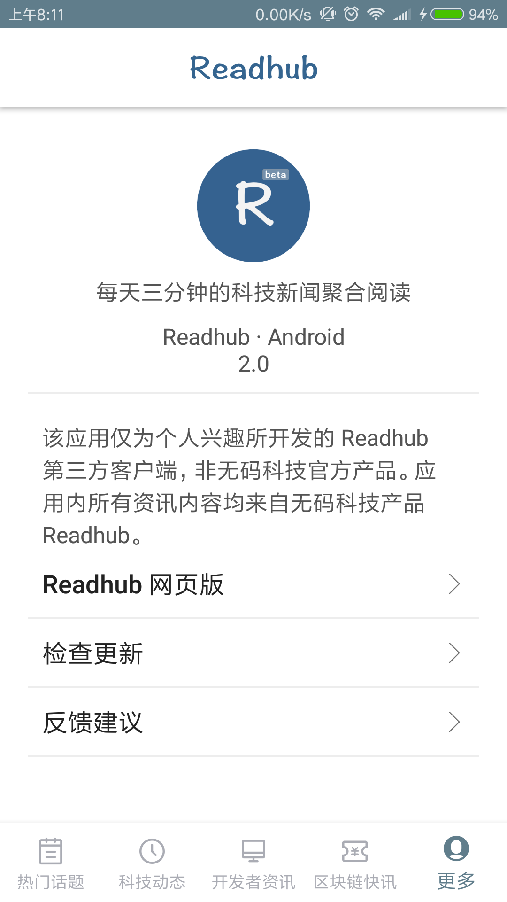

# HubRead
该应用是模仿 Readhub 第三方客户端"Readhub"，非无码科技官方产品。

## 功能
每天三分钟的科技新闻聚合阅读; <br/>

原作者Github项目:[BryantPang/ReadHub: ReadHub 第三方安卓客户端 ](https://github.com/BryantPang/ReadHub) <br/>
<a href="../art/main1.png"></a><a href="../art/main2.png"></a>
<a href="../art/main3.png"></a><a href="../art/main4.png"></a>

App体验:[ReadHub.apk](https://github.com/BryantPang/ReadHub/raw/master/apk-preview/app-debug.apk)


### 项目中用到的知识
* 开发规范:[Android 开发规范（完结版） - 简书](https://www.jianshu.com/p/45c1675bec69)
* 压缩图片:[TinyPNG – Compress PNG](https://tinypng.com/),目前我遇到最好用
  的图像压缩在线网站,一般开发中用的图片都需要经过压缩,现在网上很多压缩网站都是压
  缩完的图片,带水印免费,无水印需要你开会员,真恶心!!!
* Android基础:
  * Android基础知识复习:[尚硅谷15天Android基础(复习笔记) - CSDN博客](http://blog.csdn.net/simplebam/article/details/70213167)
  * 四大组件:
     * Activity:
        * 启动模式:[Activity的四种启动模式-图文并茂 – Android开发中文站](http://www.androidchina.net/3173.html)
        * 状态保存与恢复:[Android Activity 和 Fragment 状态保存与恢复的最佳实践](https://www.jianshu.com/p/45cc7775a44b)
        * 动画切换:[酷炫的Activity切换动画，打造更好的用户体验 - 简书](https://www.jianshu.com/p/37e94f8b6f59)
        * 标签属性:[Android Activity标签属性 - 简书](https://www.jianshu.com/p/8598825222cc)
     * PreferenceActivity:
        * [Android开发之PreferenceActivity的使用 - 简书](https://www.jianshu.com/p/4a65f4a912c6)
        * [Preference 三种监听事件说明 - wangjicong_215的博客 - CSDN博客](http://blog.csdn.net/wangjicong_215/article/details/52209380)
     * Fragment
        * [实现Activity和Fragment之前通信 - CSDN博客](http://blog.csdn.net/xuxian361/article/details/75529810)
        * [死磕 Fragment 的生命周期 - MeloDev的博客 - CSDN博客](http://blog.csdn.net/MeloDev/article/details/53406019)
        * [android fragment onHiddenChanged的使用 - CSDN博客](http://blog.csdn.net/bzlj2912009596/article/details/62851537)
           ,这里是为了解释第二篇博文准备的
        * [Fragment的setUserVisibleHint方法实现懒加载，但
          setUserVisibleHint 不起作用？ - Leevey·L - 博客园](http://www.cnblogs.com/leevey/p/5678037.html)
          ,这里是为了解释第二篇博文准备的
        * [TabLayout使用详解 - 简书](https://www.jianshu.com/p/7f79b08f5afa)
          ,这里是为了解释第二篇博文准备的
        * [套在ViewPagerz中的Fragment在各种状态下的生命周期 - CSDN博客](http://blog.csdn.net/jemenchen/article/details/52645380)
        * [Android -- Fragment 基本用法、生命周期与细节注意 - 简书](https://www.jianshu.com/p/1ff18ec1fb6b)
        * [Fragment全解析系列（一）：那些年踩过的坑 - 简书](https://www.jianshu.com/p/d9143a92ad94)
          ,这系列的四篇都很经典,建议你可以看看
        * 还不知道怎么入门解析Fragment的可以看我的面经,里面涉及了(卖个广告),
          [Android面经-基础篇(持续更新...) - CSDN博客](http://blog.csdn.net/simplebam/article/details/77989675)
        * 关于保存和恢复Fragment目前最正确的状态:[The Real Best Practices to Save/Restore Activity's and Fragment's state. (StatedFragment is now deprecated)](https://inthecheesefactory.com/blog/fragment-state-saving-best-practices/en)
     * 关于BaseActivity跟BaseFragment的封装:[从BaseActivity与BaseFragment
       的封装谈起 - Young_Kai]( http://blog.csdn.net/tyk0910/article/details/51355026)
* Material Design:
   * [Android Theme.AppCompat 中，你应该熟悉的颜色属性 - 简书 ](https://www.jianshu.com/p/15c6397685a0)
      这家伙的关于MD文章也是值得一看的,简短but精辟
   * ConstraintLayout:[Android新特性介绍，ConstraintLayout完全解析 - CSDN博客](https://blog.csdn.net/guolin_blog/article/details/53122387)
   * ToolBar:
      * [ToolBar使用心得(如何改变item的位置) - 泡在网上的日子](http://www.jcodecraeer.com/plus/view.php?aid=7667)
      * [Toolbar+DrawerLayout+NavigationView使用心得](http://www.jcodecraeer.com/a/anzhuokaifa/2017/0317/7694.html)
      * [Android ToolBar 使用完全解析 - 简书]( https://www.jianshu.com/p/ae0013a4f71a)
   * CoordinatorLayout(本身就是一个加强版的FrameLayout)可以监听其所有子控件
      的各种事件,然后自动帮助我们做出最为最为合理的响应 <--(寄生) AppBarLayout
      (垂直的LinearLayout加强版),它在内部做了很多滚动事件的封装 <--(寄生)
      CollapsingToolBarLayout(可折叠式标题栏)
   * CoordinatorLayout:
      * [CoordinatorLayout与滚动的处理-泡在网上的日子](http://www.jcodecraeer.com/a/anzhuokaifa/androidkaifa/2015/0717/3196.html)
      * [实现折叠式Toolbar：CollapsingToolbarLayout 使用完全解析 - 简书](https://www.jianshu.com/p/8ce727308f29)
   * DrawLayout:
      * [android官方侧滑菜单DrawerLayout详解 - 泡在网上的日子](http://www.jcodecraeer.com/a/anzhuokaifa/androidkaifa/2014/0925/1713.html)
      * [用Android自带的DrawerLayout和ActionBarDrawerToggle实现侧滑效果](http://blog.csdn.net/miyuexingchen/article/details/52232751)
      * [Drawer 详解 ·Material Design Part 3 - Android - 掘金](https://juejin.im/entry/5825c76d67f3560058d23657)
   * RecyclerView:
      * [RecyclerView简单使用总结 - 简书](https://www.jianshu.com/p/9b3949f7cb0f)
      * [RecyclerView使用完全指南，是时候体验新控件了（一） - 简书](https://www.jianshu.com/p/4fc6164e4709)
   * SwipeRefreshLayout:
      * [SwipeRefreshLayout详解和自定义上拉加载更多 - 简书 ](https://www.jianshu.com/p/d23b42b6360b)
      * [SwipeRefreshLayout+RecyclerView冲突的几种解决方案 - 简书](https://www.jianshu.com/p/34cbaddb668b)
   * NestedScrollView:
      * [一点见解: Android嵌套滑动和NestedScrollView - 简书](https://www.jianshu.com/p/1806ed9737f6)
      * [NestedScrollView+RecyclerView优雅的解决滑动冲突问题 - 简书](https://www.jianshu.com/p/791c0a4acc1c)
   * 看不懂物料设计的话建议买郭霖先生的《第二行代码》好一点，这本书内容对于初级
     开发者来说还是蛮不错的
   * [Android布局优化之ViewStub、include、merge使用与源码分析 - CSDN博客](http://blog.csdn.net/bboyfeiyu/article/details/45869393)
* RxBus
   * [Android RxBus的使用 - Angelica - CSDN博客 ](http://blog.csdn.net/qq_20785431/article/details/72910619)
   * [RxJava 的 Subject - 简书](https://www.jianshu.com/p/99bd603881bf)
   * [RxBus | 吴小龙同學]( http://wuxiaolong.me/2016/04/07/rxbus/)
* Http知识:
   * [你应该知道的计算机网络知识 - 简书](https://www.jianshu.com/p/21b5cbac0849)
   * [Android中的Http通信（一）之Http协议基本知识 - CSDN博客](http://blog.csdn.net/u014544193/article/details/49849843)
   * [Android之基于HTTP协议的通信详解 - 一叶飘舟 - 博客园](http://www.cnblogs.com/jdsjlzx/archive/2011/07/25/2116351.html)
* Notification通知
   * [全面解析Notification - CSDN博客 ](http://blog.csdn.net/u012124438/article/details/53574649)
   * 这里有一个问题的,就是Builder里面方法setProgress(int max, int progress,
      boolean indeterminate)的第三个参数indeterminate问题,这里有讲解,好好细
      看:[Android官方开发文档Training系列课程：通知用户之在通知中显示进度](http://www.bubuko.com/infodetail-1630910.html)
   * [PendingIntent.getActivity的使用 - 博客园](https://www.cnblogs.com/lyxin/p/5995681.html)
   * "给大家躺个坑，实用Android.support.v4.app.NotificationCompat.BigTextStyle
     的时候，当你的文本内容有感叹号的时候你的通知不会显示出来，还没有具体看源码是
     什么原因......我用的魅族PRO5，大家遇到了就将文本中的感叹号替换掉就可以了",
     在网址[Notification常见样式总结 - 简书](https://www.jianshu.com/p/6c89c3792b90)
     评论区看到
* 代码混淆:[5分钟搞定android混淆 - CSDN博客](https://blog.csdn.net/jdsjlzx/article/details/51853423)


### 项目中的用到的开源框架
* ButterKnife
  * [ButterKnife8.5.1 使用方法教程总结 - CSDN博客](http://blog.csdn.net/niubitianping/article/details/54893571)
* LitePal-Android高性能数据库框架
  * [Android数据库高手秘籍(一)——SQLite命令 - 郭霖的专栏 - CSDN博客](http://blog.csdn.net/guolin_blog/article/details/38461239)
  * [LitePal 1.6.0版本来袭，数据加解密功能保障你的应用数据安全](http://mp.weixin.qq.com/s/TSp36cnKLxUmAHjT86UCrQ)
* bugtags-移动时代首选 Bug 管理系统:[Bugtags 使用说明 - CSDN博客](http://blog.csdn.net/ObjectivePLA/article/details/51037804)
* RxJava
   * 目前最好的RxJava入门文章,没有之一:[给初学者的RxJava2.0教程(一) - 简书 ](https://www.jianshu.com/p/464fa025229e)
     以及对应的项目教程源码:[ssseasonnn/RxJava2Demo](https://github.com/ssseasonnn/RxJava2Demo)
   * [这可能是最好的RxJava 2.x 教程（完结版）- 简书](https://www.jianshu.com/p/0cd258eecf60)
   * 其他RxJava文章推荐:[RxJava2 学习资料推荐](http://mp.weixin.qq.com/s/UAEgdC2EtqSpEqvog0aoZQ)
   * [RxJava之过滤操作符 - 行云间 - CSDN博客](http://blog.csdn.net/io_field/article/details/51378909)
   * [RxJava2使用过程中遇到的坑 - CSDN博客](http://blog.csdn.net/sr_code_plus/article/details/77189478)
   * [这是一份全面 & 详细 的RxJava操作符 使用攻略](http://mp.weixin.qq.com/s/2vDZ7h6SL-LR7n3FR6OMrw)
* Retrofit
   * [你真的会用Retrofit2吗?Retrofit2完全教程 - 简书](https://www.jianshu.com/p/308f3c54abdd)
   * [Android Retrofit 2.0使用 | 吴小龙同學](http://wuxiaolong.me/2016/01/15/retrofit/)
   * [Android Retrofit 2.0 使用-补充篇 - 简书](https://www.jianshu.com/p/93153b34310e)
* Gson-解析Json数据
  * Gson教程(这个作者写的这四篇Gson文章真的很好):[你真的会用Gson吗?Gson使用指南（一） - 简书 ](https://www.jianshu.com/p/e740196225a4)
* Glide
  * [Android图片加载框架最全解析（一），Glide的基本用法 - 郭霖的专栏](http://blog.csdn.net/guolin_blog/article/details/53759439)
    郭霖写的东西都很赞,值得推荐阅读
  * [Google推荐的图片加载库Glide介绍 - 泡在网上的日子](http://www.jcodecraeer.com/a/anzhuokaifa/androidkaifa/2015/0327/2650.html)
  * [Glide 一个专注于平滑滚动的图片加载和缓存库 - 简书](https://www.jianshu.com/p/4a3177b57949)
  * [Glide V4 框架新特性（Migrating from v3 to v4） - HeXinGen的博客 - CSDN博客](http://blog.csdn.net/hexingen/article/details/72578066)
* glide-transformations
  * 网上出现了很多Glide的图片变换开源库，其中做的最出色的应该要数glide-transformations这个库了
  * [Android图片加载框架最全解析（五），Glide强大的图片变换功能 - 郭霖](http://blog.csdn.net/guolin_blog/article/details/71524668)
  * [Glide、Picasso、Fresco进阶 - 图像转换 - 简书 ](https://www.jianshu.com/p/976c86fa72bc)
  * 还是不会用Glide的话,那么推荐使用[panpf/sketch: Sketch 是 Android 上一个
    强大且全面的图片加载器,支持 GIF，手势缩放以及分块显示超大图片](https://github.com/panpf/sketch)
    无需关心TAG，因为根本就不使用TAG来关联，也自带多种图片处理效果，圆形的、圆角
    的、高斯模糊的等等
* [AlipayZeroSdk-支付宝转账工具类](https://github.com/fython/AlipayZeroSdk)
   * [如何在app中打开支付宝进行打赏开发者 - CSDN博客](http://blog.csdn.net/qq_24531461/article/details/72858868)
   * 二维码可以在支付宝手机客户端或者网页[支付宝条码支付 - 扫码](https://qr.alipay.com/paipai/personal.htm)
     获取,得到的后面参数不太一样的,然后使用[在线二维码解码器](http://jiema.wwei.cn/)
     解析出参数即可
   * 这里也有很多人推荐使用第三方支付集成库易支付:[EasyPay(易支付)，两分钟集成三种Android支付方式 - 简书](https://www.jianshu.com/p/bd4d44c33532)
     ,开源项目地址:[yansongda/easyPay - 码云 Gitee.com ](https://gitee.com/yansongda/pay)
* Multidex
  * 解决"著名的方法数超过 64K 的应用异常"的问题
  * [彻底弄清support支持库，以及v4 v7重复依赖问题深究 - 简书 ](https://www.jianshu.com/p/f769ea6db2c1)
* Fragmentation
  * [Android框架之路——Fragmentation的使用（流式交互Demo） - CSDN博客](https://blog.csdn.net/bskfnvjtlyzmv867/article/details/70849322)
* jsoup
  * [jsoup开发指南,jsoup中文使用手册,jsoup中文文档 ](http://www.open-open.com/jsoup/)


### 项目开发遇到的问题
* 原项目中使用的是腾讯Bugly的CrashReport,本项目中使用Bugtags替代。
* 在build的时候遇到了下面的红色提醒:
  ```
  Configuration 'compile' is obsolete and has been replaced with 'implementation'.
  It will be removed at the end of 2018
  (配置'compile'已经过时了,被'implementation'替代并且2018年会被移除)
  ```
  看到的时候我一脸懵圈,为什么compile会被移除,之后百度了一下,明白了Google的用意:
  [android gradle tools 3.X 中依赖，implement、api 指令 - CSDN博客](https://blog.csdn.net/soslinken/article/details/73114637)
* 现在很多项目都在使用 RxJava 开源库,但由于是静态的原因容易引发内存泄漏,一般都是
  使用 rxlifecycle 进行管理其生命周期,现在rxlifecycle 作者已经说明了准备逐步废
  弃该开源项目,链接:[为什么不使用 RxLifecycle? - 简书](https://www.jianshu.com/p/6627e97eba8d)
  ,推荐我们使用AutoDispose,但项目中我个人认为可以使用 RxJava 自身返回的Dispose
  进行切断,不必要加入这两个库
  * 关于rxlifecycle教程:
    * [RxAndroid之Rxlifecycle使用 - 享受技术带来的快乐 - CSDN博客](http://blog.csdn.net/jdsjlzx/article/details/51527542)
    * [Android 性能优化之利用 Rxlifecycle 解决 RxJava 内存泄漏 ](https://juejin.im/entry/58290ea2570c35005878ce8f)
    * [不继承RxAppCompatActivity的情况下使用RxLifeCycle - CSDN博客 ](https://blog.csdn.net/kevinscsdn/article/details/78980010)
  * AutoDispose-管理RxJava生命周期
    * [Android架构中添加AutoDispose解决RxJava内存泄漏 - CSDN博客 ](https://blog.csdn.net/mq2553299/article/details/79418068)
* 本来打算使用 RxJava 配合 RxPermissions 使用,但还是按照模仿项目,毕竟学习MVP框架
  * RxPermissions-动态申请权限
    * [RxPermissions获取运行时权限 - 简书](https://www.jianshu.com/p/314e9e27592f)
    * 当用户选择了“不再提示+拒绝”之后的处理,只能移步到系统设置去打开权限了
    * 在onResume()中处理监听到设置了禁止后不再询问
* 原项目使用的是Bugly增量更新,由于我使用Fir作为内测平台(提供查询版本的接口),所以
  这里我简单使用了这个接口,不引入Bugly


### 项目中数据提供
* ReadHub
  * 热门话题 https://api.readhub.me/topic?lastCursor=&pageSize=20
  * 即时预览 https://api.readhub.me/topic/instantview?topicId=2ywi9i7lBj7
  * 科技动态 https://api.readhub.me/news?lastCursor=1522808400000&pageSize=10
  * 开发者资讯 https://api.readhub.me/technews?lastCursor=1522808400000&pageSize=10
  * 区块链快讯 https://api.readhub.me/blockchain?lastCursor=1522808460000&pageSize=10
  * 招聘行情 https://api.readhub.me/jobs?lastCursor=&pageSize=10
* App内测:[fir.im - 免费应用内测托管平台|iOS/Android应用内测分发](https://fir.im/)
  * 关于版本更新的话,fir会提供相关的接口,说明:[fir.im - 版本查询](https://fir.im/docs/version_detection)
    其中字段id是应用ID，在"应用管理"的"基本信息"

